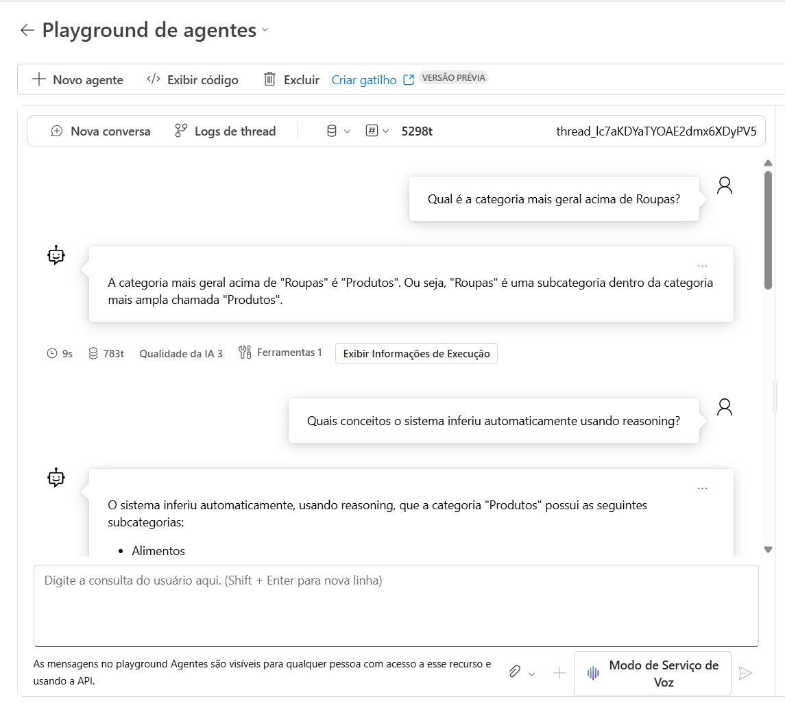
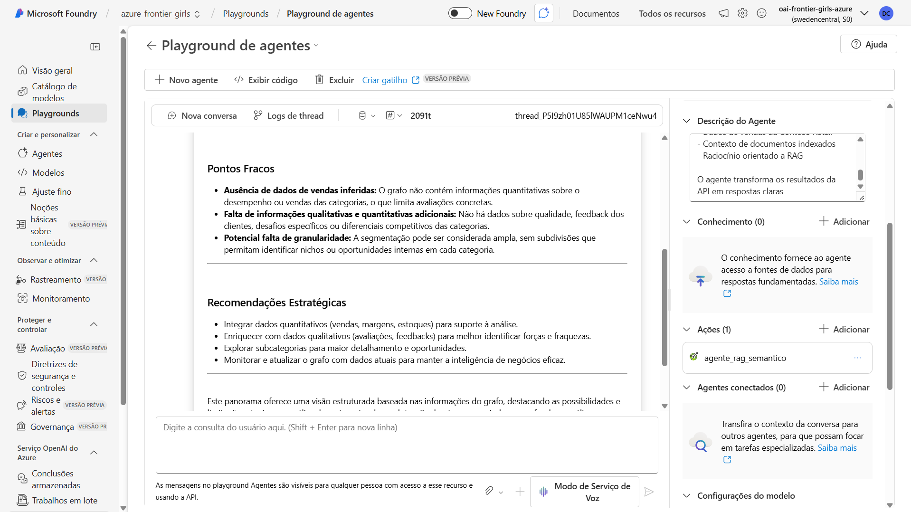
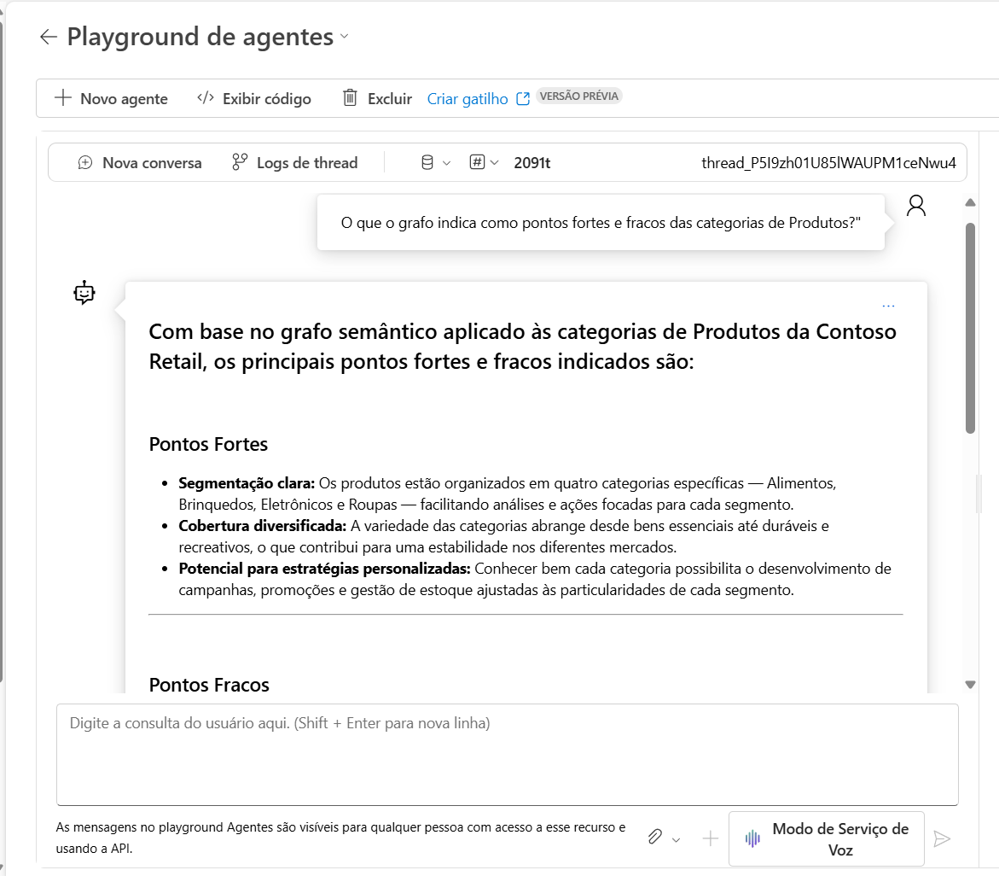

# Agente Semântico Contoso — Conectando Azure AI Search no Foundry + Grafo Semântico

Este repositório contém o projeto completo de um **Agente de Inteligência Artificial Semântica**, desenvolvido para o desafio **Azure Frontier Girls – Build Your First Copilot Challenge**.

A solução combina:

- **Ontologias (SKOS + OWL)**  
- **RAG semântico**  
- **Azure AI Search**  
- **FastAPI**  
- **ngrok**  
- **Azure AI Foundry com ferramenta HTTP**  

Criando um agente capaz de responder perguntas de forma precisa, explicável e alinhada ao conhecimento oficial da empresa *Contoso* (empresa fictícia para fins educativos).

---
## 1. Objetivo do Agente

A Contoso precisava de um **Analista Virtual Semântico**, capaz de conectar diferentes fontes de informação que, isoladas, não entregavam respostas completas.  
O objetivo do agente é justamente **unificar esses dados e reconstruir o contexto** necessário para responder perguntas de forma clara e fundamentada.

Para isso, o agente combina:

- **conhecimento estruturado** (grafo com conteúdos e relações),  
- **conteúdo do PDF indexado pelo Azure AI Search**,  
- **modelagem semântica baseada em SKOS e OWL**,  
- e **interpretação da linguagem natural**.

Essa integração permite que o agente realize **RAG semântico**, onde:
- o grafo entende o contexto e como os conteúdos se relacionam,  
- e o Azure Search AI traz os trechos relevantes do PDF.

Assim, o agente consegue responder perguntas que dependem de **contexto, relações e evidências**, entregando análises mais completas dentro do Azure AI Foundry.

##  2. Problema de Negócio

Empresas como a Contoso lidam com:

- grandes catálogos de produtos  
- muitas regiões de vendas  
- conceitos semelhantes com nomes diferentes  
- documentos extensos em PDF  
- ausência de padronização semântica  
- dificuldade para localizar insights rapidamente  

Com isso, equipes enfrentam problemas como:

- **dificuldade de unificar informações vindas de sistemas diferentes**
- **demora para entender hierarquias de produtos**  
- **respostas inconsistentes entre analistas**  
- **incapacidade de recuperar informações confiáveis**  
- **ambiguidade entre termos**  
- **perda de tempo em consultas manuais**
- **LLMs gerando respostas incorretas por falta de padronização semântica**
- **tempo perdido refinando prompts porque o modelo não tem conhecimento formal**

A Contoso precisava de um **Analista Virtual Semântico**, capaz de conectar:

- conhecimento estruturado
- conteúdo do PDF
- inferência lógica
- linguagem natural  

---

##  3. Objetivo da Solução

Construir um agente inteligente que:

- entende a pergunta do usuário em linguagem natural  
- identifica conceitos SKOS corretamente  
- utiliza ontologias OWL para representar relações semânticas entre conceitos  
- busca contexto no PDF indexado  
- gera respostas analíticas e explicáveis  
- responde através do Azure Foundry usando ferramenta HTTP  

O objetivo final:  
**Fornecer respostas confiáveis, padronizadas e contextualizadas.**

---

## 4. Benefícios para a Própria Tecnologia LLM

A solução foi projetada para **corrigir limitações conhecidas dos LLMs**, ampliando sua confiabilidade:

### 4.1 Redução de Alucinações  
A ontologia guia o modelo para respostas mais precisas.

### 4.2 Consistência Semântica  
SKOS/OWL mantém categorias e relações coerentes, independentemente da forma da pergunta.

### 4.3 Contexto Estruturado  
O LLM usa conhecimento governado, auditável e padronizado.

### 4.4 Estrutura Semântica Explícita
O uso combinado de SKOS e OWL permite representar conceitos, categorias e relações de forma formal e reutilizável, oferecendo uma camada semântica complementar ao LLM.

### 4.5 Recuperação Dirigida  
Azure AI Search + Grafo reduzem ruído e melhoram a precisão do RAG.

### 4.6 Explicabilidade  
Cada resposta pode ser rastreada em:

- triplas RDF  
- regras OWL  
- trechos do PDF  

### 4.7 Redução de Custos  
Menos tokens → menos chamadas → menor custo de operação.

---

## 5.Arquitetura Geral do Pipeline

```
Planilha (.xlsx) → PDF → Azure AI Search → Grafo RDF (SKOS/OWL) → RAG Semântico → FastAPI → ngrok → Azure Foundry

```

### 5.1) **PDF → Azure AI Search**  
Indexação para recuperação de insights.

### 5.2) **Grafo RDF (SKOS + OWL)**  
Base de conhecimento estruturado.

### 5.3) **Reasoning OWL-RL**  
Inferências automáticas.

### 5.4) **FastAPI**  
Endpoint `/perguntar`.

### 5.5) **ngrok**  
Exposição global da API.

### 5.6) **Azure AI Foundry**  
Agente usa ferramenta HTTP para consultar o backend.

---

## 6. Visão Geral do Projeto

```
+---------------------+
|     Usuário         |
+----------+----------+
           |
           v
+-------------------------------+
|  Azure Foundry (Agente IA)    |
|  - Usa a ferramenta HTTP      |
+-------------------------------+
           |
           v
+-------------------------------+
|  FastAPI /perguntar?q=...     |
|  (exposta via ngrok)          |
+-------------------------------+
           |
           v
+-------------------------------+
|   Pipeline Semântico RAG      |
|   - Grafo SKOS/OWL            |
|   - Reasoning OWL-RL          |
|   - Azure AI Search    |
|   - Interpretação OpenAI      |
+-------------------------------+
           |
           v
+---------------------+
|     Resposta        |
+---------------------+
```

---

## 7. Arquitetura Semântica do Agente

### **Componentes principais**
| Camada | Tecnologia | Função |
|--------|------------|--------|
| 📘 Representação | SKOS, OWL, RDF | Conceitos, categorias e hierarquias |
| 🧩 Semântica | SKOS + OWL | Representação formal de conceitos e relações |
| 🔍 Recuperação | Azure AI Search | Contexto do PDF |
| 🔧 API | FastAPI | Endpoint `/perguntar` |
| 🌐 Exposição | Ngrok | Tornar a API acessível ao Foundry |
| 🤖 Agente | Azure AI Foundry | Usa a ferramenta HTTP |
| 🧠 RAG | Azure OpenAI | Combinação de grafo + texto |

---

## 8. Fluxo Completo da Solução

```
                     ┌───────────────────────────────────────────────┐
                     │                     INÍCIO                    │
                     └───────────────────────────────────────────────┘
                                   |
                                   v
                        ┌─────────────────────────┐
                        │   Pergunta do Usuário   │
                        └─────────────────────────┘
                                   |
                                   v
                ┌───────────────────────────────────────────────┐
                │ Azure Foundry chama a ferramenta HTTP do agente│
                │         consultar_agente_rag                   │
                └───────────────────────────────────────────────┘
                                   |
                                   v
                        ┌──────────────────────────────┐
                        │ FastAPI recebe /perguntar    │
                        └──────────────────────────────┘
                                   |
                                   v
            ┌──────────────────────────────────────────────────────────┐
            │ PROCESSAMENTO DO AGENTE (5 etapas)                       │
            │----------------------------------------------------------│
            │ 1) Identifica o conteúdo relevante                       │
            │    usando o grafo SKOS/OWL (criado da planilha .xlsx)    │
            │                                                          │
            │ 2) Verifica relações: categorias, hierarquias, conexões  │
            │                                                          │
            │ 3) Utiliza as relações semânticas definidas no grafo RDF │
            │                                                          │
            │ 4) Busca contexto no PDF via Azure Cognitive Search AI   │
            │    (indexado previamente)                                │
            │                                                          │
            │ 5) Monta o prompt final para o modelo OpenAI             │
            └──────────────────────────────────────────────────────────┘
                                   |
                                   v
                        ┌──────────────────────────────┐
                        │ Azure OpenAI gera a resposta │
                        └──────────────────────────────┘
                                   |
                                   v
                        ┌──────────────────────────────┐
                        │ FastAPI devolve JSON final   │
                        └──────────────────────────────┘
                                   |
                                   v
                        ┌──────────────────────────────┐
                        │ Foundry apresenta a resposta │
                        └──────────────────────────────┘
                                   |
                                   v
                        ┌──────────────────────────────┐
                        │              FIM             │
                        └──────────────────────────────┘

```
---

## 9. Prints Obrigatórios

Os **prints** essenciais para avaliação foram adicionados na pasta /prints.
Acesse cada etapa detalhada pelos links abaixo 👇📸

🚨 Prints Obrigatórios Disponíveis — acesse os links:

[📄 Abrir PDF 1](./docs/1-mesclado.pdf)

[📄 Abrir PDF 2](./docs/mesclado.pdf)

🔗 [Página 1](./docs/pagina1.md)
🔗 [Página 2](./docs/pagina2.md)
🔗 [Página 3](./docs/pagina3.md)

---

## 10. Agente funcional no Foundry

[📄 Abrir PDF](./docs/37-mesclado.pdf)





*Mais prints do agente no Foundry: [clique aqui](./docs/pagina3.md)*

## 11. Estrutura do Repositório

```
/
├── api.py                        # API FastAPI do agente
├── requirements.txt              # Dependências Python
├── openapi.json                  # Esquema da ferramenta HTTP usada no Foundry
├── README.md                     # Este arquivo
│
├── data/
│   ├── knowledge_graph.ttl       # Grafo RDF com SKOS + OWL
│   ├── planilha_equipe_dados.xlsx# Planilha usada para estruturar o grafo
│   └── documento.pdf             # PDF indexado no Azure AI Search
│
├── notebooks/
│   └── notebook.ipynb            # Pipeline completo: XLSX → PDF → Grafo → RAG
│
└── prints/                       # Prints de execução e Foundry
```

---

# **Como Rodar Localmente**

## 1. Criar ambiente virtual

```bash
python -m venv venv
banana\Scriptsctivate
pip install -r requirements.txt
```

## 2. Rodar a API

```bash
uvicorn api:app --reload --port 8000
```

## 3. Expor com ngrok

```bash
ngrok http 8000
```

Copiar a URL exibida:

```
https://abcd1234.ngrok-free.app
```

---

# **Testar a API**

```
https://SEU-NGROK.ngrok-free.app/perguntar?q=Produtos
```

Exemplo de resposta:

```json
{
  "status": "ok",
  "pergunta": "Produtos",
  "resposta": "Lista de categorias, relações SKOS e insights estratégicos."
}
```

---

# **Integração com Azure Foundry**

## 1. Criar nova Ferramenta (OpenAPI)

- Método: **GET**  
- Autenticação: **Nenhuma**  
- Nome sugerido: `agente_rag_semantico`  
- Importar: **openapi.json**  

## 2. Configurar o Agente

Instrução recomendada:

```
Você é um agente semântico especializado em responder perguntas sobre vendas, produtos, categorias, regiões e análises estratégicas da Contoso Retail.

Regras de operação:

1. Quando o usuário fizer uma pergunta sobre vendas, regiões, números, produtos, categorias ou análises:
   - Primeiro consulte o KNOWLEDGE (PDFs, planilhas). Use o mecanismo de retrieval.
   - Se o Knowledge não contiver a informação necessária, então chame a ferramenta "consultar_api_rag".

2. Ao usar a ferramenta "consultar_api_rag":
   - Envie a pergunta original para o parâmetro “q”.
   - Leia o campo “resposta” e apresente de forma clara.
   - NÃO invente dados. NÃO responda com conhecimento próprio.

3. Se tanto o Knowledge quanto a API retornarem vazio:
   - Peça ao usuário para reformular.

4. Estilo:
   - Claro, objetivo, analítico.
   - Pode fornecer síntese e insights APENAS com base nos dados recuperados.


```

## 3. Testar

O Foundry chamará:

```
GET /perguntar?q=<texto>
```

E mostrará a resposta retornada pela API.

# **Requisitos do Desafio — Checklist Oficial**

| Requisito | Status |
|----------|--------|
| Repositório público | ✔ |
| README completo e claro | ✔ |
| Storytelling + problema de negócio | ✔ |
| Explicação do fluxo | ✔ |
| Prints de execução | ✔ |
| Agente funcional no Foundry | ✔ |
| Pelo menos 1 ação funcional | ✔ |
| Entrega individual | ✔ |

---

# **Conclusão**

O **Agente Semântico Contoso** combina ontologia, reasoning, RAG e linguagem natural em um pipeline híbrido moderno, sólido e explicável.

A solução entrega:

- confiabilidade  
- padronização  
- governança de dados  
- respostas inteligentes  
- integração real com Foundry  
- grafos de conhecimento + IA generativa  

# Implementações Futuras

- Integração de um mecanismo de inferência semântica baseado em OWL-RL para geração automática de novas relações no grafo RDF.

- Ampliação do grafo para suportar regras de negócio e consultas semânticas mais complexas.

- Integração do Agente Semântico Contoso ao futuro Agente de Governança Semântica, conectando-se ao Purview para operações automáticas em glossários e coleções.
---

# **Referências**

**Links das Plataformas Utilizadas (exigência do desafio)**

Azure AI Foundry — https://ai.azure.com

Azure AI Search — https://learn.microsoft.com/azure/search/

Azure OpenAI Service — https://learn.microsoft.com/azure/ai-services/openai/

FastAPI — https://fastapi.tiangolo.com/

Ngrok — https://ngrok.com

**Referências Técnicas**

W3C SKOS — https://www.w3.org/TR/skos-reference/

OWL 2 — https://www.w3.org/TR/owl2-overview/

RDF (W3C) — https://www.w3.org/RDF/

RDFlib — https://rdflib.readthedocs.io/en/stable/

OWL-RL Reasoner — https://github.com/RDFLib/OWL-RL


## Fundamentação Acadêmica e científica 
- Este projeto integra conhecimentos de modelagem semântica, ontologias e organização do conhecimento desenvolvidos durante meu doutorado em Ciência da Informação na ECA/USP.